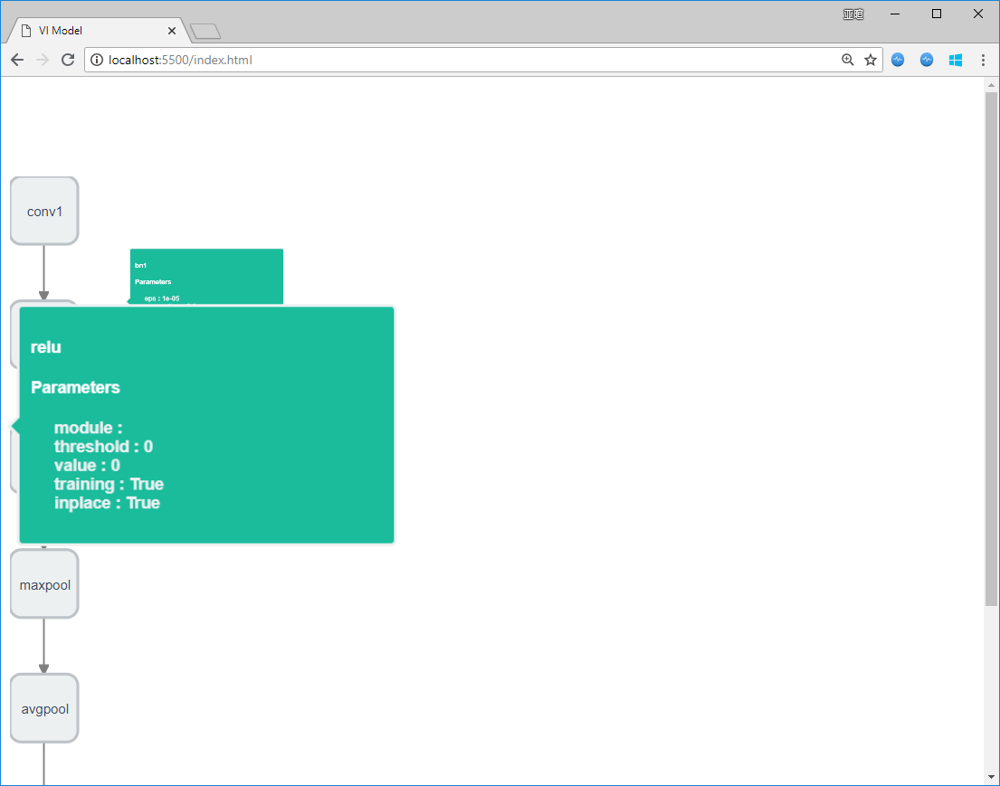

# VIsualize Model

Fork from [phodal/Sherlock](https://github.com/phodal/sherlock).

Could help on graph architecture visualization. It has not only a node flow, but card for each node, could list members and parameters.

#### Node Format

Should convert the graph module or model into a json:

```json
{"skills":[ {
      "id": 3,
      "name": "conv1",
      "discription": "Convolution layer",
      "depend": [1],
      "parameters": [
          {
            "k": "kernel",
            "v": "3x3"
          },
          {
              "k": "frozen",
              "value": true
          }
      ]
    }],
 	"maxPoints": 2
}
```

Replace `app/data/example.json` with the graph json. And change its parse method.

#### Node Info Card

Rewrite `./app/template/description.html` to parse every node's json. 


#### Graph Converter

PyTorch converter done. But without nested _module visualization.

